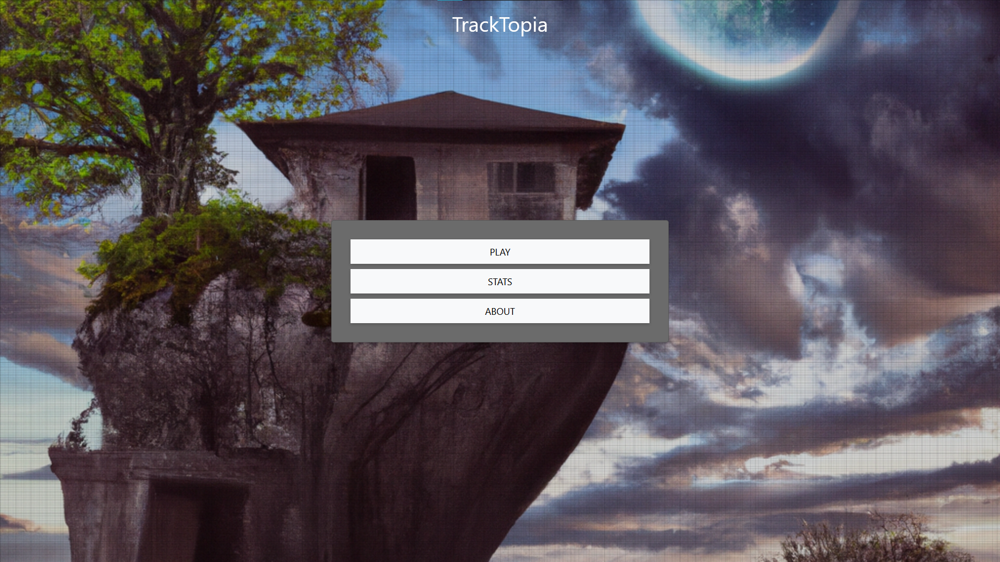

<div align="center">
  <p>↓ Click to see a preview of the website on YouTube ↓</p>
  <a href="https://youtu.be/nyBvqxfpAWQ" target="_blank">
    
  </a>
</div>

# **TrackTopia: A Game Based on Your Spotify Data**
TrackTopia is an interactive game that utilizes your Spotify data to ask you questions. As the sole creator of this project, I embarked on this endeavor fueled by my passion for music and my desire to delve into the lyrics of my favorite tracks. Not only did I develop this website to enhance my programming skills, but also to deepen my understanding of song lyrics. I used a variety of technologies to build this web application, including Node.js, JavaScript, HTML, CSS, and Bootstrap 5.
<br/><br/>
# **Installation guide**
Follow these steps to install TrackTopia on your system:
1. **Clone the repository to your desired location**
     - Begin by cloning the repository. Make sure you have NodeJS installed on your system. In the repository directory, execute the command "npm install" to install all the necessary node modules.
<br/><br/>
2. **Setup of the .env and config.js files**
      - First, open the .env file and set the values for CLIENT_ID and CLIENT_SECRET variables. You can obtain these variables by creating an app in the <a href="https://developer.spotify.com/">Spotify Developer Dashboard</a>. Follow their instructions to generate the required credentials.
      - Additionally, set the PORT variable to "5500" in the .env file. If you wish to use a different port, make sure to update it accordingly in other files as well.
      - Next, create a config.js file in the cloned repository directory. To do this, obtain an API key from <a href="https://www.last.fm/api">Last.fm</a>. Once you have the API key, insert it into the following code snippet:
        ```javascript
        export const config = {
            API_KEY: 'YOUR-API-KEY' //paste your API-key here
        };
        ``` 
        Replace 'YOUR-API-KEY' with your actual API key and save the config.js file.
<br/><br/>
3. **Installation is done**
   - You are now ready to launch TrackTopia. Open a terminal in the repository directory and enter the command "npm start". To access the website, open any web browser and navigate to "localhost:5500/" in the address bar. Enjoy the game and explore your Spotify data in a fun and interactive way!
<br/><br/>
# **Future Plans**
In the pipeline for future updates, the multiple choice button will be enhanced with added functionality. Additionally, a planned feature involves allowing users to order custom shirts adorned with their favorite tracks, potentially leading to the web application's acceptance for public use by Spotify. These developments aim to expand the application's capabilities and provide users with more interactive and personalized experiences.
<br></br>
# **Licensing**
This project is licensed under the MIT License, chosen for its open-source nature, legal clarity, and promotion of collaboration. The MIT License allows users to freely use, modify, and distribute the software, aligning with the principles of the open-source community.
